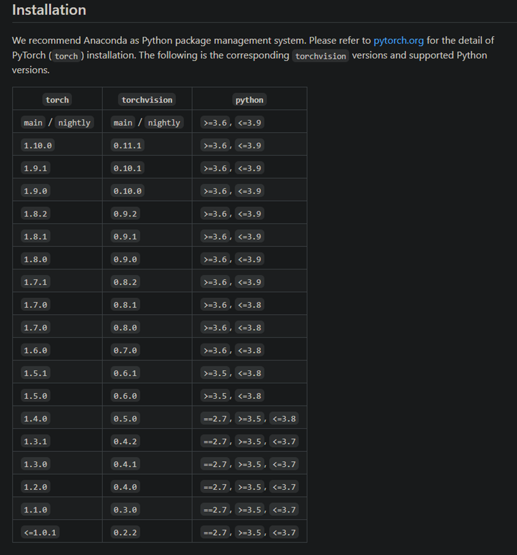
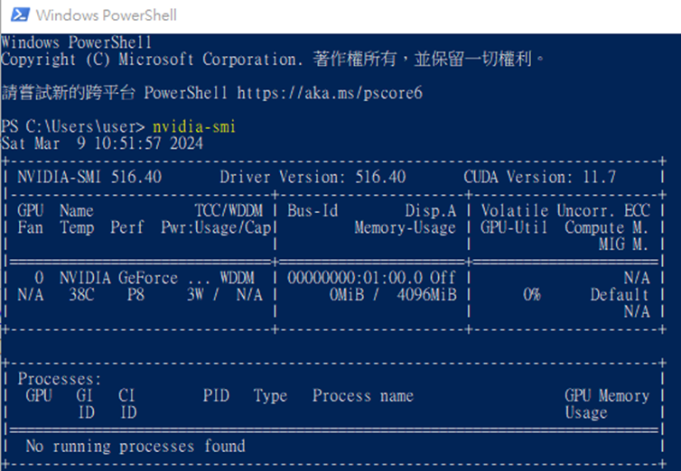
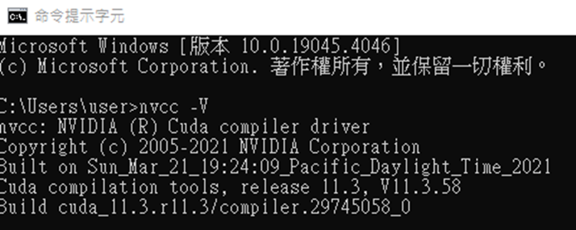
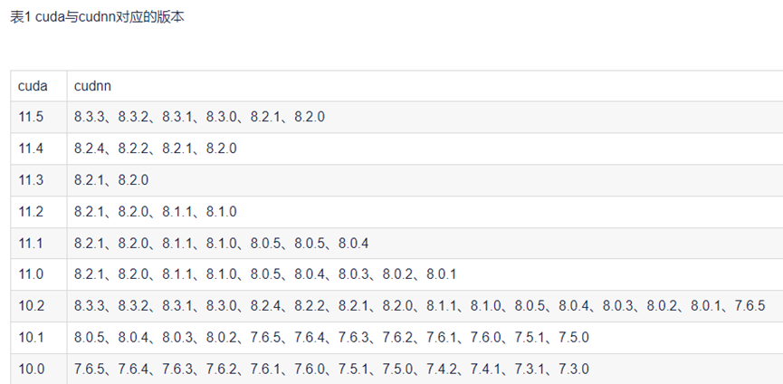
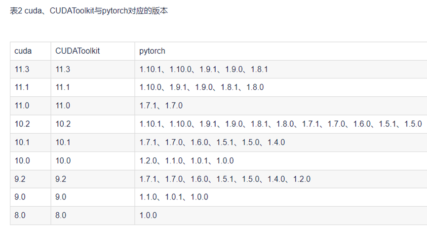
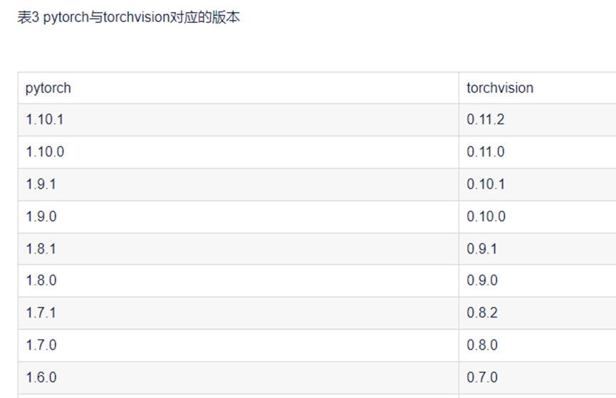
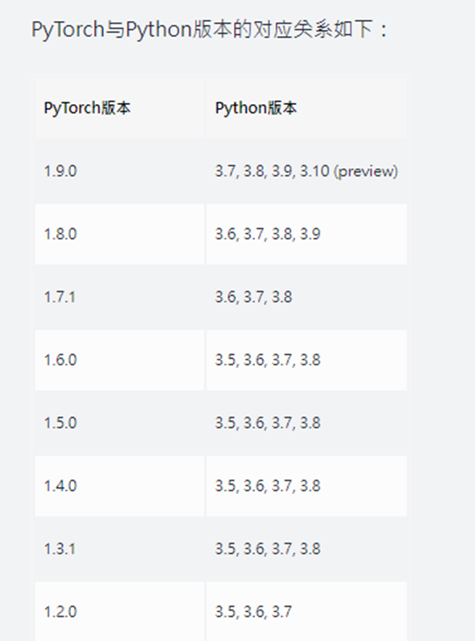

Python Pytorch GPU框架安裝與測試,適用於NVIDIA顯示卡
--
*https://github.com/pytorch/vision#installation*
*https://developer.nvidia.com/rdp/cudnn-archive*

#### ==NVIDIA GeForce GTX 1650==


----

Pytorch想用GPU跑ML環境卻裝不好?看完這篇帶你避開各種雷!
--
*https://medium.com/@anannannan0102/pytorch-%E6%83%B3%E7%94%A8gpu%E8%B7%91ml%E7%92%B0%E5%A2%83%E5%8D%BB%E8%A3%9D%E4%B8%8D%E5%A5%BD-%E7%9C%8B%E5%AE%8C%E9%80%99%E7%AF%87%E5%B8%B6%E4%BD%A0%E9%81%BF%E9%96%8B%E5%90%84%E7%A8%AE%E9%9B%B7-3bf259fc7396*

## 1. 顯卡及CUDA版本
## 2. Python版本
## 3. Pytorch版本

-----
Win10 安裝 CUDA、cuDNN 教學
==
*https://medium.com/ching-i/win10-%E5%AE%89%E8%A3%9D-cuda-cudnn-%E6%95%99%E5%AD%B8-c617b3b76deb*

## 1.	安裝NVDIA顯示卡驅動程式版本(可更新): 516.40
*https://www.nvidia.com/zh-tw/geforce/drivers/*
#### 查詢顯示卡版本最高可支援的CUDA版本: cmd => nvidia-smi
#### 最上面可以看到我的顯卡驅動是516.40，支援的CUDA到11.7版




## 2.	下載CUDA Version 11.3並安裝



## 3.	下載CUDNN Version: cudnn-11.3-windows-x64-v8.2.1.32 並安裝
*https://developer.download.nvidia.com/compute/redist/cudnn/* 
#### Pytorch环境配置——cuda、、cudnn、torch、torchvision对应版本（最全）及安装方法
*https://blog.51cto.com/u_15905131/5918588*





## pytorch与python版本对应表
*https://juejin.cn/s/pytorch%E4%B8%8Epython%E7%89%88%E6%9C%AC%E5%AF%B9%E5%BA%94%E8%A1%A8*



## 4.	確定Python版本並安裝: ==3.8.12==
## 5.	確定對應Pytorch版本並安裝: ==1.9.0==
## 6.	確定對應torchvision版本並安裝: ==0.10.0==
## 7.	確定對應cudatoolkit版本並安裝: ==11.3==
## 8.	安裝指令: ```conda install pytorch==1.9.0     torchvision==0.10.0 cudatoolkit=11.3 –c pytorch(Pytorch CPU: OK)```

## 9.	```pip install torch==1.12.1+cu113 torchvision==0.13.1+cu113 torchaudio==0.12.1 --extra-index-url https://download.pytorch.org/whl/cu113 https://pytorch.org/get-started/previous-versions/ (Pytorch GPU: OK)``` 
  
 
## 10.	檢查確認Pytorch GPU是否安裝成功並可正常運行

### 1. ```import torch```
### 2. ```torch.cuda.is_available()```
### 3. ```python –version #Python Version: 3.8```
### 4. ```torch.__version__ #Pytorch Version: 1.9.0```
### 5. ```torch.version.cuda #CUDA Version: 11.3```
### 6. ```torch.backends.cudnn.version() #cuDNN Version: 8.2.1```
### 7. ```torchvision: 0.10.0```
